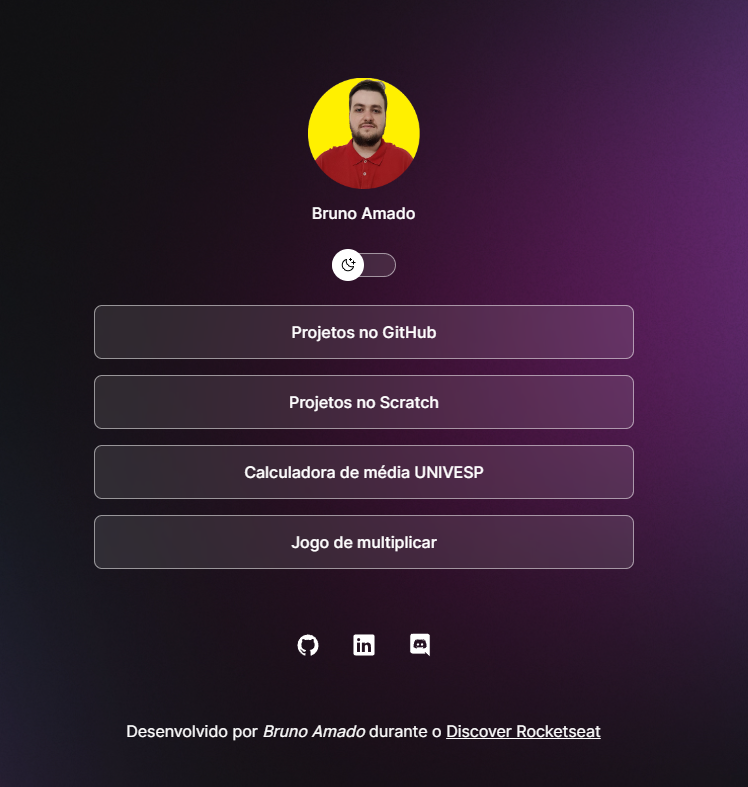

<h1 align="center"> Agregador de links </h1>
<h2 align="center">Visualize o projeto através deste link: <a href="https://bruamado.github.io/rocketseat-discover/">https://bruamado.github.io/rocketseat-discover/</a></h2>
 

  

 Projeto desenvolvido durante o curso Discover da <a href="https://rocketseat.com.br/">Rocketseat</a>

 
 
 
 

# 📖Principais pontos de aprendizado
- Uso do display: none, inline, block e flex

- Uso do position: absolute para posicionar um elemento de maneira absoluta ou relativo a outro elemento

- Adaptação do background e elementos de maneira relativa ao tamanho do dispositivo

- Utilização de animações e transformações (no uso de transições)